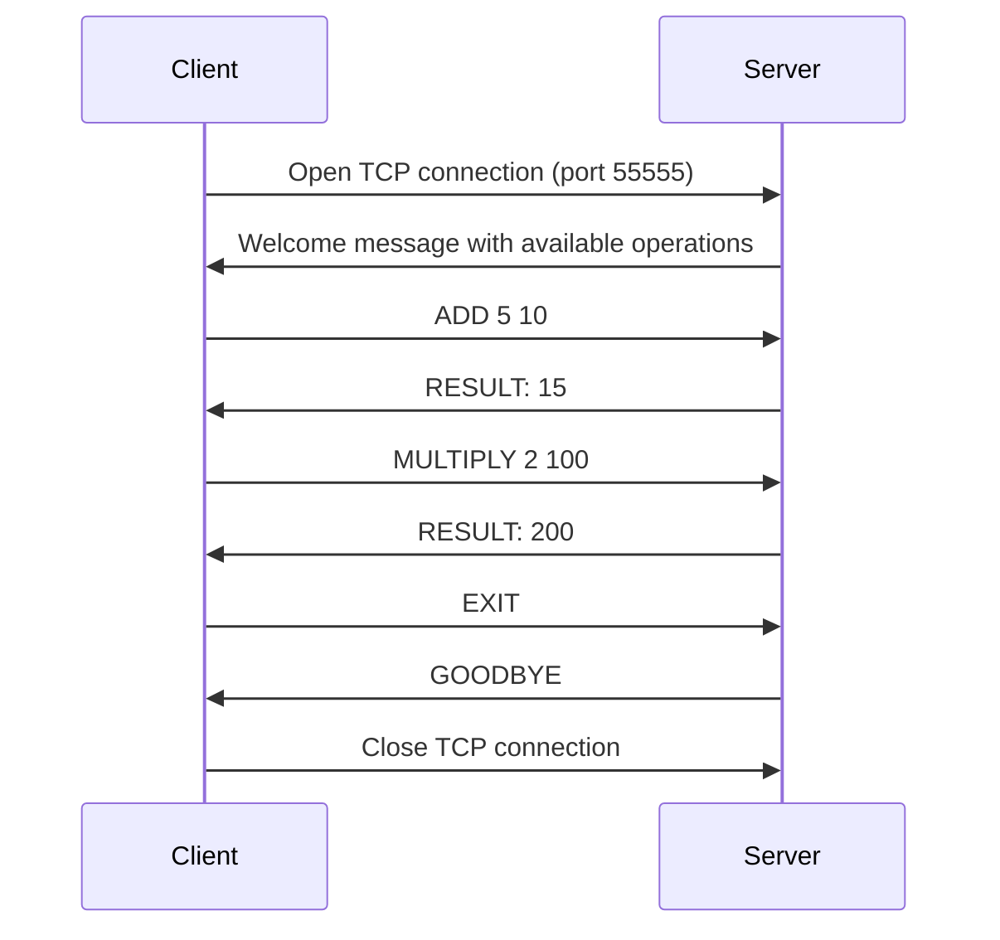
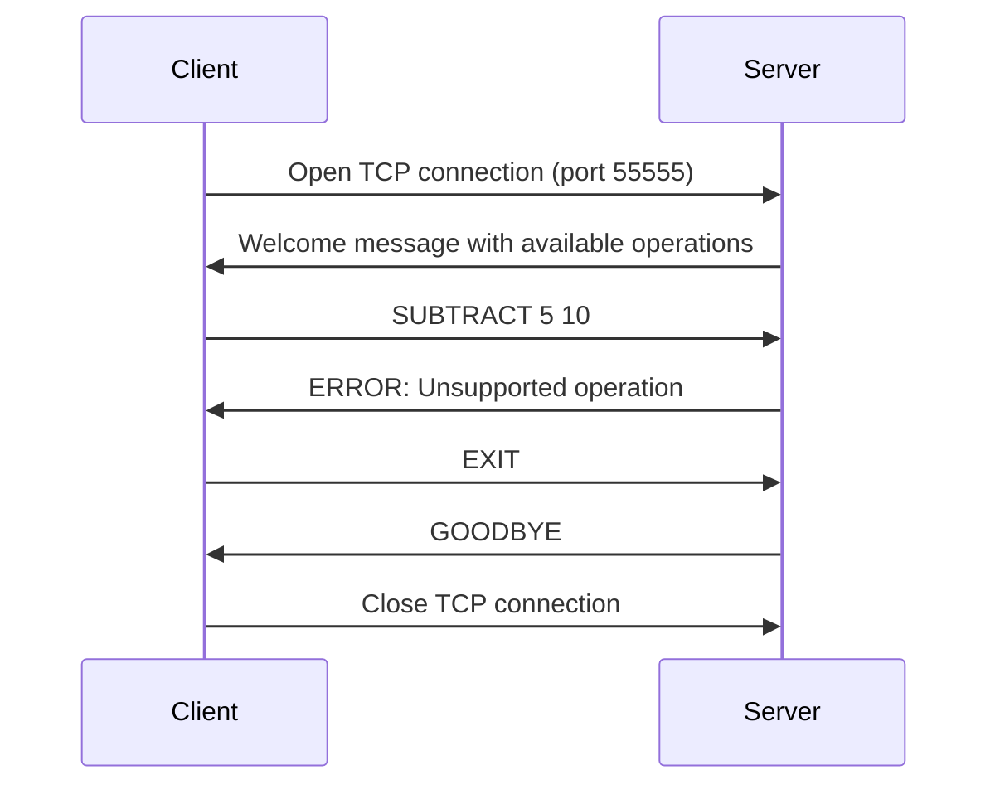
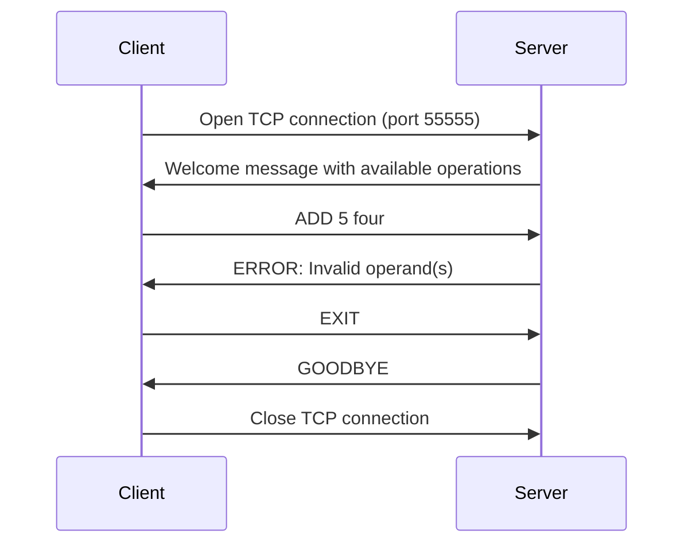
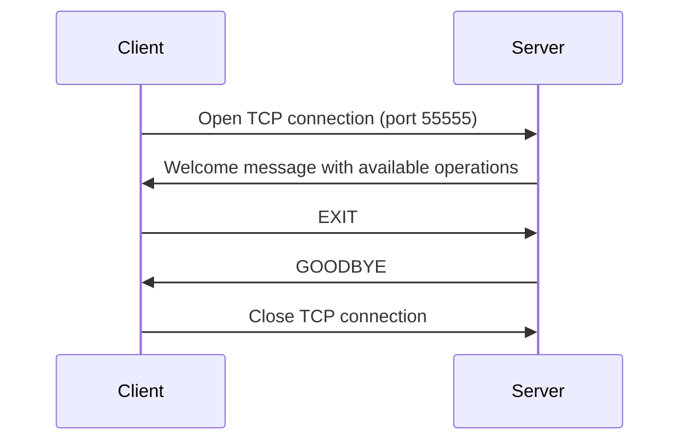
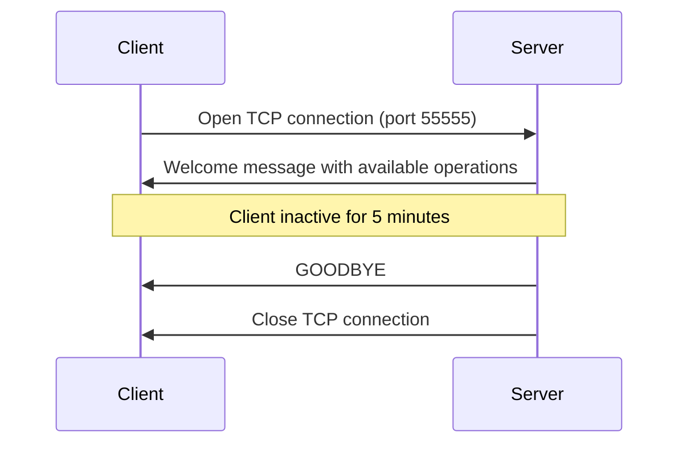

# Specification of our protocol

## Overview

Our protocol defines the interactions between a client and a server whose purpose is to process mathematical operations. The client sends text commands to the server to perform specific mathematical operations, such as addition or multiplication. The server receives the command, interprets it, executes the mathematical operation, and sends back the result to the client. Our protocol is based on a TCP connection to ensure reliable communication between the endpoints.

## Transport layer protocol

Our protocol uses TCP. The client establishes the connection, so it must know the IP address of the server. The server listens on TCP port 55555. When a client connects, the server sends a welcome message listing the available operations.

The client closes the connection by sending a specific message when its calculations are finished, or the server closes the connection if no messages have been sent by the client in the last 5 minutes.

## Messages

When the connection is established, the server speaks first by sending a welcome message listing the available operations.

### Client messages

The messages sent by the client consist of an operation specified by its name and operands or an exit message. 

##### Operations

```
ADD <operand1> <operand2>
```

```
MULTIPLY <operand1> <operand2>
```

##### Exit

```
EXIT
```

### Server messages

The messages sent by the server consists of a welcome message, a RESULT, an ERROR or a GOODBYE.

##### Welcome message

```
Welcome ! Here is the list of the available operations :
- ADD <operand1> <operand2>
- MULTIPLY <operand1> <operand2>
```

##### Success

```
RESULT: <operation_result>
```

##### Error

```
ERROR: <error_message>
```

```
<error_message> ::= "Unsupported operation" | "Invalid operand(s)"
```

##### Goodbye

Its purpose is to inform the client that the connection is closed.

```
GOODBYE
```

Messages are UTF-8 encoded with "\n" as end-of-line character.

## Example dialogs

### Successful operations



### Error: Unsupported operation



### Error: Invalid operand



### Client closes connection



### Server closes connection


